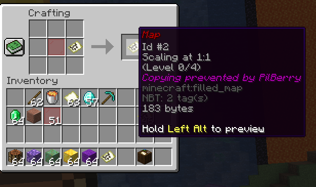

# NoMapartCopying

A PaperMC plugin designed to allow a map author to make their maps uncopyable. This was written over several months (large breaks) and is fairly simple overall.

## Usage for server owners

1. Download the latest jar from the [releases page](https://github.com/AnotherPillow/NoMapartCopying/releases), from a Github workflow if applicable or build from source
    - To build from source, download this repository and run `./gradlew.bat build` (or just `./gradlew build` if not on Windows)
2. Place the resulting .jar in your server's plugins folder.

## Usage for players

1. [Create a map](https://minecraft.wiki/w/Map#Mapping)
2. Create your desired copies. You won't be able to make any more after it is locked. 
3. Combine it with a red stained glass pane in a crafting table

4. You may now safely distribute this map. It cannot be copied and this lore will stay. (TODO: Cartographer's table). If a player attempts to copy it, no item will be created in the crafting table.

## Inspiration

The skyblock.net community, including [this post](https://skyblock.onl/threads/option-to-disable-mapart-copying.144363/).

## LICENSE

GNU AGPL 3.0